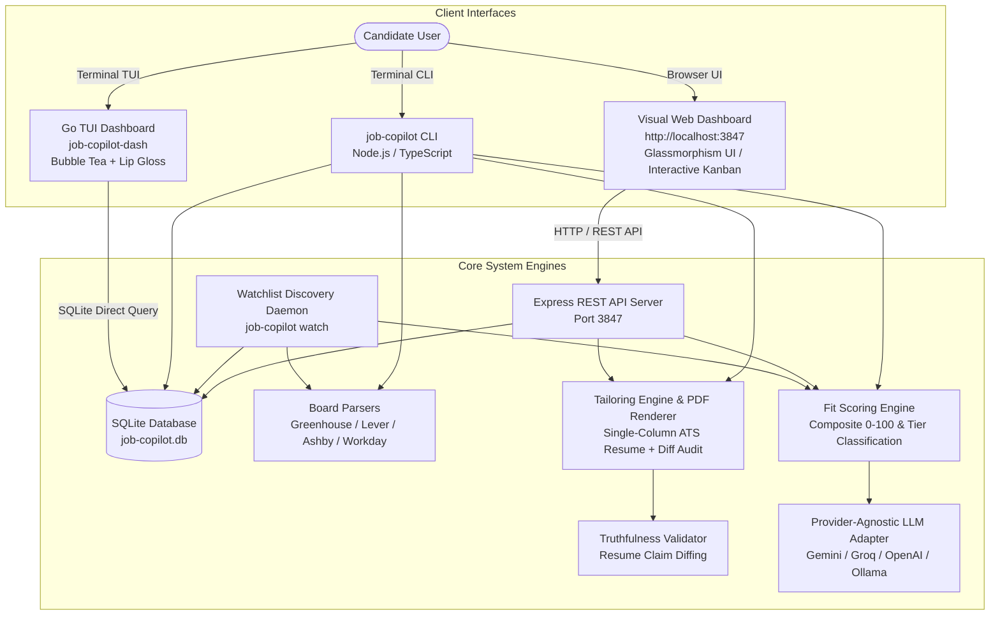

# AI Job Search Co-Pilot 🤖🚀

> A production-quality, local-first system that replaces manual spreadsheet job workflows entirely. Ingest job postings, score them against your resume with explainable reasoning, generate tailored ATS-optimized application assets, continuously discover new openings, and view your entire pipeline in a **Visual Web Dashboard** or a **Terminal TUI Dashboard**.

---

## System Architecture Diagram



---

## Module Breakdown

1. **Module 1 — Job Ingestion & Parsing (`job-copilot add <url>`)**
   - Native parsers for Greenhouse, Lever, Ashby, Workday, SmartRecruiters.
   - Generic Readability extraction fallback for non-standard career pages.
   - Normalizes titles, locations, salaries, required skills, and seniority.
   - SHA-256 company+title+location deduplication.

2. **Module 2 — Fit Scoring Engine (`job-copilot score <job-id>`)**
   - Evaluates resume fit on a 0–100 scale across 6 weighted dimensions:
     - Skills match (35%) — semantic synonyms & framework overlap
     - Experience & Seniority alignment (25%)
     - Career trajectory fit (15%)
     - Compensation fit (10%)
     - Location & Remote policy fit (10%)
     - Company signals (5%)
   - Classifies jobs into Tiers: **Tier A (80+)**, **Tier B (60–79)**, **Tier C (40–59)**, **Tier D (<40)**.
   - Generates an explainable scorecard markdown report in `./reports/`.

3. **Module 3 — Tailored Resume Generation (`job-copilot tailor <job-id>`)**
   - Single-column, ATS-compliant Markdown + PDF resume generation.
   - Strict truthfulness validator diffing every claim/metric against `resume.md`.
   - Generates `./applications/<company-slug>/`:
     - `resume.pdf` (Rendered ATS PDF)
     - `resume.md` (Tailored markdown source)
     - `changes.md` (Diff summary & ATS coverage score before/after)
     - `cover-letter.md` (Optional grounded cover letter)

4. **Module 4 — Automated Job Discovery (`job-copilot watch`)**
   - Scans company job boards listed in `watchlist.yaml` on a schedule.
   - Maintains a persistent `watcher_seen` ledger so jobs are reported once.
   - Generates daily Markdown digests in `./digests/YYYY-MM-DD.md`.

5. **Module 5 — Visual Web Dashboard & Terminal TUI Dashboard**
   - **Visual Web Dashboard**: Interactive browser UI at `http://localhost:3847` with drag/drop Kanban pipeline, 1-click job scoring, live scorecard breakdown, ATS PDF generator, and ground-truth resume editor.
   - **Terminal TUI Dashboard (`job-copilot-dash`)**: Built with Go (Bubble Tea + Lip Gloss). Features Vim keybindings (`h/j/k/l` navigation, `H/L` card movement, `Tab` view toggle, `Enter` detail view).

---

## Quickstart

### 1. Prerequisites
- **Node.js**: v20+
- **npm**: v10+
- **Go** (optional for building native `job-copilot-dash` TUI binary): 1.21+

### 2. Installation
```bash
# Clone repository
git clone https://github.com/suryakant-source/Job-Copilot.git
cd Job-Copilot

# Install dependencies and build Node CLI & Web Server
npm install
npm run build
```

### 3. Launch Web Dashboard (Browser Interface)
```bash
npm run web
# Opens Visual Web Dashboard at http://localhost:3847
```

### 4. Basic CLI Usage
```bash
# Ingest & score a job posting
node dist/cli.js add https://boards-api.greenhouse.io/v1/boards/stripe/jobs/12345

# Score an existing job
node dist/cli.js score gh_1a2b3c4d5e6f

# Tailor resume + PDF + cover letter
node dist/cli.js tailor gh_1a2b3c4d5e6f --cover-letter

# Run single-pass watchlist scan
node dist/cli.js watch --once
```

### 5. Launch Go Terminal TUI Dashboard
```bash
cd dashboard
go run main.go
```

---

## Running Tests

```bash
# Run unit & integration test suite
npm test

# Run Go tests
cd dashboard && go test ./...
```

---

## License

MIT © Antigravity AI Systems
